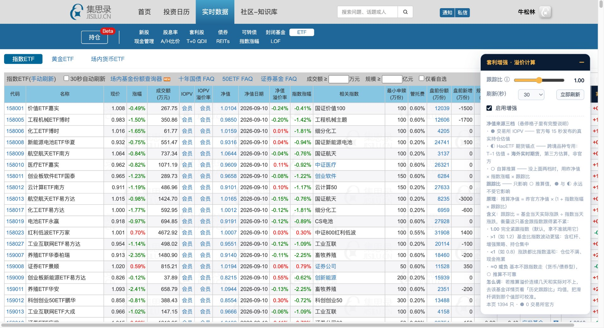
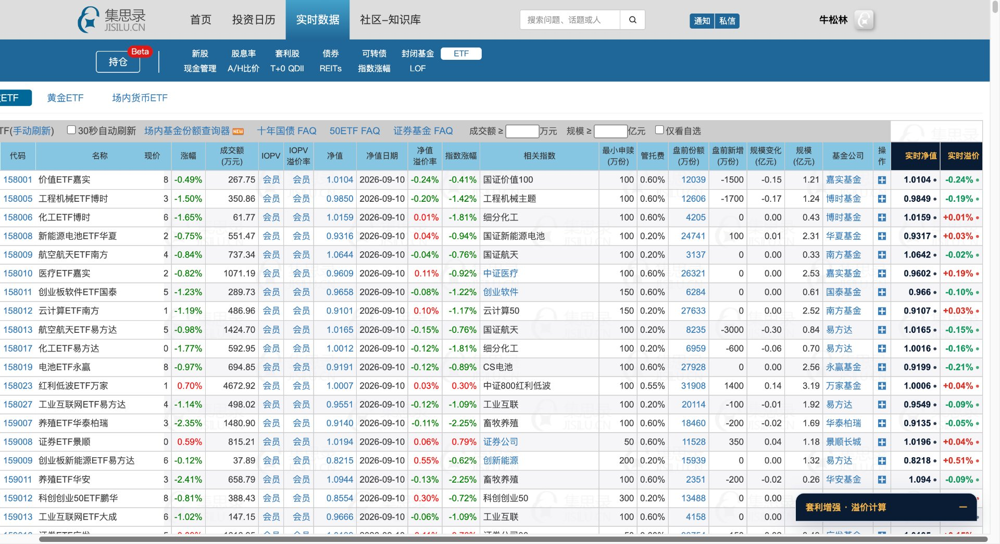
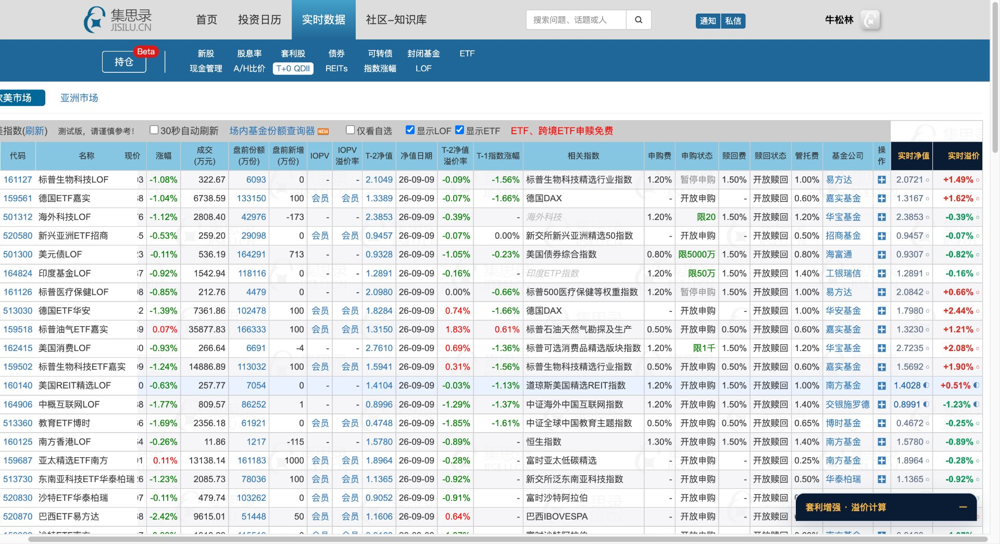
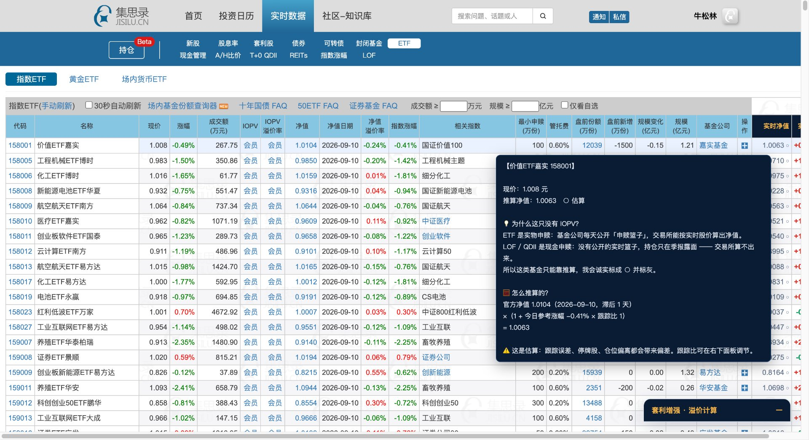
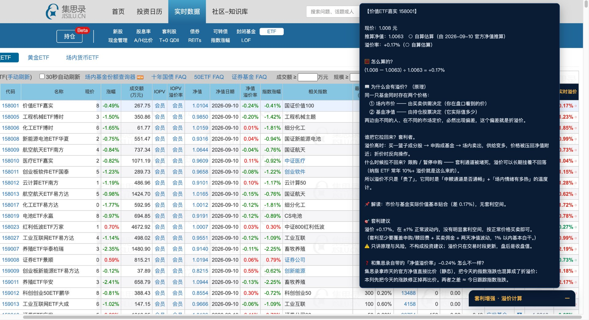
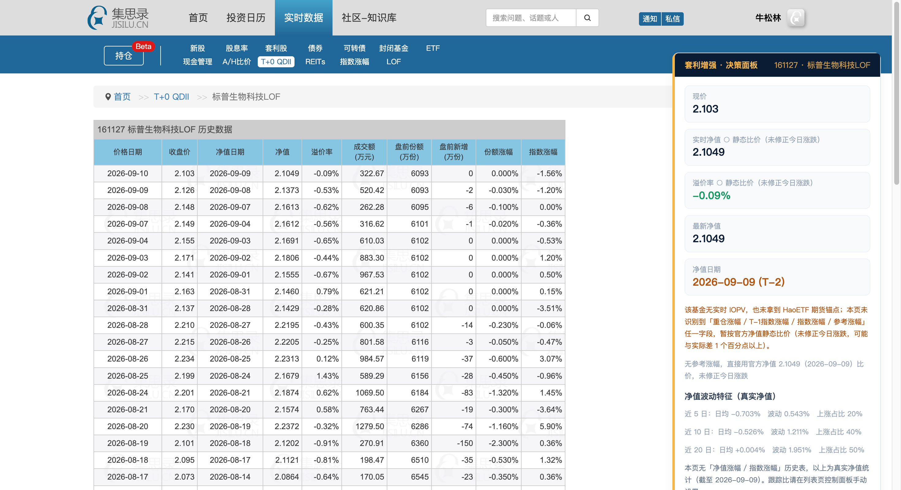

# 集思录套利增强（QDII / LOF / ETF）

列表页注入「实时净值 + 实时溢价」两列（**● 交易所 IOPV / ◐ 海外期货锚点 / ○ 自算推算** 三级自适应），悬停讲原理与套利建议。
免费、纯前端、离线加载、不上传任何数据。



---

## 效果示例

> 以下截图均为**真实集思录页面实机运行**（2026-09-10 盘中），非示意的设计稿。

### 1. 列表页：末尾追加两列 + 右侧浮动控制面板

表格最右侧新增 **实时净值** 与 **实时溢价** 两列，**代码 / 名称**两列横向滚动时保持冻结（sticky）。
右侧常驻控制面板：跟踪比滑杆、刷新频率、开关、立即刷新，以及 ●/◐/○ 三档图例。


### 2. ETF 列表：● 档 —— 交易所 IOPV 真值

ETF 有公开申赎篮子，交易所能算出真值，所以整列走 **●**（交易所官方，非估算）。
此时「实时溢价」列就是**最硬的套利信号**，没有估算误差。



### 3. QDII 列表：档位自适应 —— ● / ◐ / ○ 同页共存

跨境 ETF 有 IOPV 走 **●**，HaoETF 覆盖的跨境品种走 **◐**（海外期货锚点），两者都没有的走 **○**（自算）。
同一页里三档并存、按行各自判定，不留空值。



### 4. 悬停讲原理：为什么这只没有 IOPV

LOF 是现金申赎、没有公开实时篮子，交易所算不出净值 —— 插件直接把这个**机制原因**讲清楚，而不是含糊地丢一个估算数。



### 5. 悬停讲原理：为什么会折溢价 + 套利建议

溢价列悬停给出完整链条：**为什么会有溢价（两条定价路径）→ 谁把它拉回来（申赎机制）→ 什么会失效（限购 / 通道堵）→ 具体建议**，并明确对比集思录静态溢价率的口径差异（详见第三节）。



### 6. 详情页：独立决策面板

详情页顶部注入决策面板：现价 / 实时净值 / 溢价率（带同一套 ●◐○ 档位）/ 最新净值 / **真实净值日期（来自历史净值序列，非占位）** / 净值波动特征（近 5/10/20 日日均涨跌、波动率、上涨占比）。



---

## 一、它解决什么问题

集思录列表页的「IOPV / IOPV 溢价率 / 估值」是**会员列**，未登录显示"登录/会员"；
QDII 基金净值普遍 **T-2 滞后**，只看静态数据会错过盘中套利窗口。

本插件把这两块补上，并且**能拿到交易所真值时绝不用估算**。

---

## 二、核心设计：三级数据源降级

先说人话：要知道一只场内基金现在是「贵了还是便宜了」，得拿 **市价** 和 **它实际值多少钱** 比。「实际值多少钱」有三个来源，按可信度排序：

| 优先级 | 来源 | 适用 | 说明 | 标记 |
| --- | --- | --- | --- | --- |
| 1 | **交易所 IOPV** | 全部 ETF、部分跨境 ETF | 交易所每 15 秒按基金持仓的一篮子证券现价实时算出，**是交易所发布的数据，不是估算** | **●** |
| 2 | **海外期货锚点**（HaoETF） | 40 只跨境 QDII / QDII-LOF | 跨境品种在 A 股盘中海外休市，用「A 股指数 × 跟踪比」推算在方法论上**就是错的** —— 正确锚点是**海外期货**。该源给的是 `T-1 估值 + 实时期货` | **◐** |
| 3 | **自算推算** | 前两档都拿不到的品种 | `昨净值 × (1 + 参考涨幅 × 跟踪比)`；连参考涨幅都没有时退化为官方净值静态比价 | **○** |

溢价率 = `(市价 − 实时净值) ÷ 实时净值`

- 有 IOPV 时**优先**用它，零估算误差
- 没有 IOPV 但有海外期货锚点时用 ◐，比自算准得多（跨境品种此前只能靠 A 股指数硬推）
- 三档都算出来并存，可交叉对照；悬停里讲清每个数是怎么来的

### 为什么第 2 档是「方法论的修正」而不是「又一个估算」

QDII 跟踪的是海外市场，A 股交易时段海外休市 —— 此时**用 A 股指数涨跌推海外基金净值，是拿不相关的变量做外推**。
HaoETF 的算法正是把锚点换回海外期货：`实时估值 = T-1 估值 + 海外实时期货`（道指 / 纳指100 / 标普500 / 原油 / 黄金）。
腾讯行情取不到期货（`hf_GC / hf_CL / hf_NQ` 实测全空），这是目前**唯一可得的免费期货锚点源**。

> ⚠️ 该源是**第三方站点自行估算**，不是交易所官方净值。插件里所有 ◐ 值都带「第三方估算」声明，绝不冒充官方数据。

### 与同类插件的差异

同类工具（如锚点数据套利工具箱）对**所有**品种都用「跟踪指数涨幅 × 跟踪比」估算；
本插件先读交易所 IOPV 真值，跨境品种再挂海外期货锚点，只有两者都拿不到才自算。


---

## 三、功能

### 列表页（`/data/qdii/`、`/data/lof/`、`/data/etf/`）

三页统一注入 **2 列**，追加在表格末尾：

| 列 | 说明 |
| --- | --- |
| **实时净值** | 这只基金此刻值多少钱。**●** = 交易所每 15 秒发布的官方实时净值（IOPV），**不是插件算的**；**◐** = 交易所不发布、但有海外期货锚点（跨境品种），蓝色显示；**○** = 两者都没有，用 `昨净值 × (1 + 参考涨幅 × 跟踪比)` 自算 |
| **实时溢价** | `(现价 − 实时净值) ÷ 实时净值`。正 = 买入要多付，负 = 打折买。悬停含完整计算过程 + 折溢价套利建议 |

两列都会**自适应**：有 IOPV 用 ●，没有就看有没有期货锚点（◐），再没有才自算（○），不留空。

| 页面 | 档位实测分布（游客前 20 行） | 说明 |
| --- | --- | --- |
| ETF | ● 20 / ◐ 0 / ○ 0 | 最准，全部走交易所真值 |
| QDII | ● 11 / ◐ 2 / ○ 7 | 跨境 ETF 有 IOPV；QDII-LOF 视 HaoETF 覆盖情况落 ◐ 或 ○ |
| LOF | ● 0 / ◐ 0 / ○ 20 | 交易所不给 LOF 发 IOPV，且主动型 LOF 不在 HaoETF 覆盖内 |

> **为什么 ETF 有 IOPV 而 LOF 没有**：ETF 是实物申赎，基金公司每天公开「申赎篮子」（一篮子股票），交易所能按实时股价算出净值；LOF 是现金申赎，没有公开的实时篮子、持仓只在季报露面 —— 交易所算不出来。

**同时冻结左侧「代码 / 名称」两列**（position: sticky），横向滚动到最右也知道在看哪只。

- **浮动控制面板**：跟踪比滑杆（0.5~1.5，**只影响 ○ 自算档**）、刷新频率（10/15/30/60 秒/关闭）、开关、立即刷新；面板常驻图例解释 ●/◐/○ 含义
- **悬停讲原理**：净值列讲 IOPV 怎么来的 / LOF 为什么没有 / ◐ 为什么期货才是对的锚点；溢价列讲计算过程 + 套利建议（含申赎门槛、T+2 时延、限购状态提示）

### 详情页（`/data/*/detail/{code}`）

在页面顶部注入独立决策面板（不依赖页面表格结构）：

- 关键指标：现价 / **实时净值（带 ●◐○ 档位，与列表页同一口径）** / 溢价率（同档位） / 最新净值 / **净值日期（真实值，来自历史净值序列）** / 估算净值（仅 ○ 档展示，因为只有它被采用）/ 参考涨幅（标明取自哪个字段）
- **档位说明随数据源切换**：◐ 档显示期货锚点原理 + 第三方来源声明；○ 档显示自算口径与偏差警示；两档**互斥**，不会串档
- **前十大持仓 · 盘中涨幅汇总**：按权重加权平均涨幅 + 逐只贡献度排序；持仓为季报数据，滞后超 45 天会显式警示「基金可能已调仓，精度未必高于指数法」
- **净值波动特征**：页面无历史表时，用真实净值序列给出近 5/10/20 日日均涨跌、波动率、上涨占比
- **历史跟踪比**：页面有历史表时算近 5/10/20 日均值与标准差，支持一键回写全局跟踪比
- **取不到的数据整块不渲染**，不留「未能获取 / 加载中」占位

---

## 四、数据来源（全部免费）

| 数据 | 来源 |
| --- | --- |
| 列表页行数据（现价/净值/参考涨幅/申赎状态） | 页面已渲染 DOM |
| **IOPV 实时净值估值** | `qt.gtimg.cn` 字段 [78] |
| 溢价率（腾讯算好的静态溢价） | 字段 [77] |
| 单位净值 | 字段 [81] |
| **◐ 海外期货锚点实时估值** | `www.haoetf.com` 首页（服务端渲染 HTML，无需 Referer） |
| **历史净值序列（真净值日期 / 波动特征）** | `fund.eastmoney.com/pingzhongdata/{code}.js` |
| 前十大持仓 | `fundf10.eastmoney.com` 季度持仓 ⚠️ 见下方限制 |
| 持仓股实时涨幅 | `qt.gtimg.cn` 批量 |

**未使用任何会员接口、付费接口，也不绕权限。**

### 关于净值序列为什么要单独找源

东财持仓接口 `FundArchivesDatas.aspx` **强制校验 `Referer`**（实测：不带 Referer → HTTP 404，带上 → 200 + 12KB 数据）。
但 `Referer` 属于浏览器**禁用请求头**（forbidden header name），JS `fetch()` 里显式设置会被**静默丢弃** —— 所以扩展后台无法伪造它。

`pingzhongdata` 无此限制（无 Referer 也 200），故历史净值走此源；持仓则接受「拿不到就不显示」。

---

## 五、安装

1. 打开 `chrome://extensions/`
2. 右上角开启「开发者模式」
3. 点击「加载已解压的扩展程序」→ 选择本目录 `jisilu-arbitrage/`
4. 打开集思录列表页，`Cmd+R` 刷新

> 改动代码后需在扩展页点 ↻ 重载，并刷新集思录页面。
> 改动 `manifest.json` 后**必须**重载扩展。

---

## 六、已知限制（诚实声明）

1. **全量扫描依赖登录态**：未登录时集思录只渲染前 20 行，插件只能处理页面上已渲染的行。
2. **◐ 档只覆盖 40 只跨境品种**：HaoETF 仅覆盖其列表内的 40 只（原油 / 标普 / 纳指 / 中概 / 黄金 / REIT 等）。其中还有 13 只是因为**该源自己标注「无相关期货，无法估值」**（如标普医药 / 标普生物 / 美国消费 / 印度基金 / 德国30 / 法国CAC40）—— 这些仍回落 ○ 自算。老板观察清单里的 **501312 华宝海外科技不在其覆盖内**，目前走 ○。
3. **◐ 是第三方估算，不是官方净值**：跨境品种用海外期货做锚点比 A 股指数硬推可靠得多，但仍不是交易所数据，已在 UI 与悬停里显式声明。
4. **QDII 自算档存在真实偏差**：净值 T-2 + 参考涨幅 T-1 + 汇率波动，估算值只是参考，不是承诺。请用跟踪比自行校准。
5. **前十大持仓在扩展里大概率拿不到**：东财持仓接口要 `Referer`，而 `Referer` 是浏览器禁用头、JS 无法伪造（详见第四节）。拿不到时整块不渲染。
6. **季报持仓天然滞后**：即使拿到，也是季度数据（实测样本滞后 72 天）。基金可能已调仓，用它算的盘中涨幅**精度未必高于「指数涨幅 × 跟踪比」**，面板会显式警示。
7. **LOF 基本没有 IOPV**：这是品种机制决定的（非缺陷），LOF 主要看 ○ 自算列。
8. **深度实值/长期停牌品种**的估算可能失真，请结合成交额与申赎状态判断。

---

## 七、验证

```bash
npm test                    # 56 项单元测试（行情解析/三级降级/档位唯一真相源/详情页档位一致性/第三方源健壮性/净值序列/参考涨幅/持仓/清单完整性）
npm run verify:live         # 真页注入验证：QDII 列表页几何 + 计算 + ●◐○ 档位分布
npm run verify:live -- https://www.jisilu.cn/data/etf/   # 指定页面
npm run verify:detail             # 详情页面板离线验证（默认 161028，○ 自算档）
npm run verify:detail -- 160140   # 跨境品种，验 ◐ 期货锚点档
```

真页验证会检查：表头注入列数 == 表体注入列数（== 2）、各行注入列数一致、净值列与溢价列填充率、**●/◐/○ 三档计数**、冻结列 computed style（position/left/背景不透明）。

详情页验证还会断言**档位一致性**：HaoETF 可用时必须走 ◐ 并声明第三方来源、不可用时不许出现 ◐、不许残留硬编码的 `●真值/○估算` 旧文案、◐ 与 ○ 的说明块不得串档。

---

## 八、目录结构

```
jisilu-arbitrage/
├── manifest.json
├── background/service-worker.js   行情/持仓/HaoETF 抓取 + 缓存（GBK 解码，按条目分 TTL）
├── core/
│   ├── quotes.js      腾讯行情解析（以 CNY 为锚点定位 IOPV，防字段漂移）
│   ├── premium.js     三级降级计算 + 净值取值(pickNav) + 档位定义(MARKS/LABELS) + 套利建议 + 悬停说明
│   ├── haoetf.js      HaoETF 跨境实时估值解析（注释剔除 + 头尾锚点 + 内容特征定位）
│   ├── nav.js         历史净值序列解析（pingzhongdata）+ 波动统计
│   ├── dom.js         列表页自适应适配（data-name 契约）+ 参考涨幅优先级
│   ├── holdings.js    天天基金持仓解析 + 加权涨幅
│   ├── track.js       跟踪比历史统计
│   └── format.js      格式化与涨跌配色
├── content/
│   ├── jisilu-list.js     列表页增强
│   ├── jisilu-detail.js   详情页面板（与列表页共用档位口径）
│   └── ui/                样式与面板组件
├── storage/repository.js  设置 / 自选 / 跟踪比覆写
├── tools/                 图标生成与验证脚本
├── tests/                 单测 + 真实抓取样本
├── examples/screenshots/  实机运行截图（本 README 第二节引用）
└── docs/
    └── feasibility-study.html   立项可行性研究报告（含各免费数据源实测结论）
```

> 仓库根目录**就是插件本体**：`git clone` 后直接「加载已解压的扩展程序」指向仓库根即可，无需再进子目录。


---

## 九、关键技术决策

- **字段锚点定位**：腾讯行情以 `~CNY~` 为锚向前定位净值/IOPV/溢价率，避免字段增删导致整体位移（已加自洽性单测锁定）。
- **HaoETF 表格不能按表头索引取值**：该页表头声明 23 列，但数据行只有 20 个 `<td>`（部分列被 HTML 注释掉）。必须先剔除 `<!-- -->` 注释，再用「头部 6 列固定 + 尾部 4 列固定 + 中段按内容特征（两个 MM-DD 日期 + 相邻数值/百分比）」定位，否则必然错位。
- **第三方数据必须可机器验证真伪**：HaoETF 每行都带「实时溢价」，插件用 `(现价 − 实时估值) / 实时估值` 复算与之比对（容差 0.06pp）；`checked === false` 的行**宁可不用**，防止把该站自己都算错的数当权威。实测 27 通过 / 0 失败 / 13 因无期货数据不足。
- **档位定义唯一真相源**：`●◐○` 的标记与文案只在 `core/premium.js` 定义，列表页与详情页都从 `markOf/labelOf` 取；有静态源码单测拦住硬编码。
- **核心列绝不被加分源拖住**：后台 `fetchText` 带 8 秒 AbortController 硬超时（第三方源假死时消息必须能返回）；前台 `run()` 是「取行情 → 先画两列 → 取 HaoETF → **有变化才补画**」，**禁止**把 HaoETF 与行情 `Promise.all` 一起等 —— 否则一笔卡住会导致两列完全不渲染。HaoETF 侧另加 8 秒软超时，超时按「本档不可用」降级。
- **第三方源失败时不覆盖已有值**：HaoETF 请求失败时保持 `state.haoetf` 原样，一次抖动不能把界面上已点亮的 ◐ 抹回 ○。
- **不写死 table id**：自适应查找「含 6 位数字 id 数据行」的表格，兼容 QDII/LOF/ETF 三页与未来改版。
- **先删后加**：每次注入前清除所有 `data-jsa-col` 节点，杜绝重复或残缺。
- **自愈守护**：MutationObserver + 5 秒兜底轮询，页面 30 秒自动刷新后自动重建。
- **context 失效防护**：调 chrome API 前检查 `chrome.runtime.id`，扩展重载后不报错。
